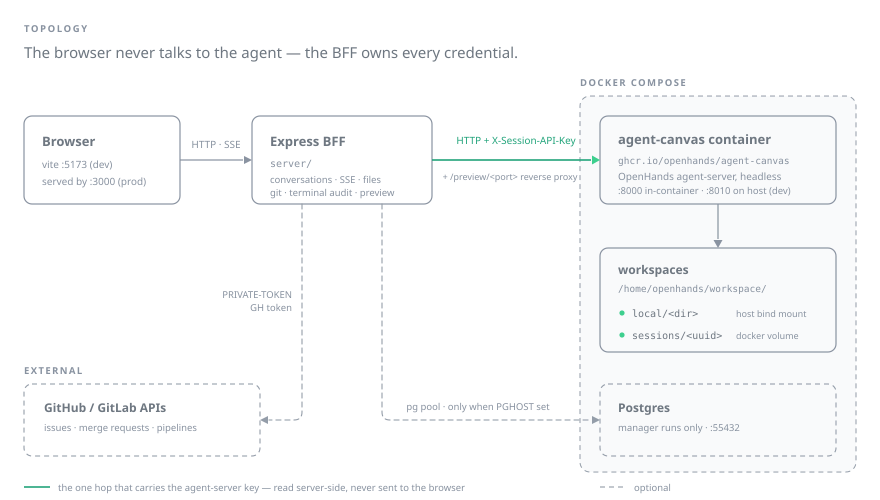

# Customizable DCA



[](LICENSE)
[](https://leoncheng.dev/Customizable-DCA-OpenHands/openhands/contributing)

A customizable, standalone, local-first web IDE for driving
[OpenHands](https://github.com/OpenHands/OpenHands) coding-agent conversations — a self-contained
runner extracted (with written approval) from an internal developer platform.

It is deliberately built to be **forked and reshaped**: the agent-server is a dependency, the BFF
is the product. See [docs/extending.md](docs/extending.md).

> **[Live demo](https://leoncheng.dev/Customizable-DCA-OpenHands/)** — an interactive simulation of
> the UI that runs **entirely in your browser on fixture data**. There is no agent, no backend and
> no LLM behind it: nothing you type is executed, nothing is stored, and every conversation,
> repository and file you see is fake. It exists to show the interface, not to do work. To actually
> run agents, use one of the quickstarts below.

**Docs:** [leoncheng.dev/Customizable-DCA-OpenHands/openhands/contributing](https://leoncheng.dev/Customizable-DCA-OpenHands/openhands/contributing)
— the same markdown that lives in [`docs/`](docs), rendered as a site (and in-app under
**Contributing**).

MIT-licensed. See [Trademarks](#trademarks).

## What it is

A **BFF + SPA wrapped around a headless agent container**. The browser never talks to the
agent-server directly; the BFF holds every credential.

| Piece | What it is |
|---|---|
| **Server** | Express BFF (`server/`) — conversation lifecycle, transcript events (SSE), files/diffs/git, read-only terminal audit, live preview reverse proxy, manager runs, GitLab MR viewer/merge |
| **Client** | React + Vite + Tailwind v4 (`client/`) — the full "native" conversation UI |
| **Agent** | `ghcr.io/openhands/agent-canvas` run headless via docker compose; the BFF calls its HTTP API with an auto-generated `X-Session-API-Key` read from `./.state` |

Single-tenant by design: one user, one agent container, one git identity. Conversations get
separate working directories but share the container. Full topology, conversation lifecycle and
the BFF ↔ agent-server contract: [docs/architecture.md](docs/architecture.md).

## Features

**Conversations**

- Transcript with tool chips, readable reasoning rows, lifecycle controls, steering, and
  follow-ups with image paste
- **Plan mode** (like Claude Code's): the agent researches read-only and write actions are held
  for approval; approving switches the session to Build. It is the agent-server's
  `confirmation_policy` plus an LLM security analyzer, switchable mid-run
- Per-conversation *and* per-follow-up model choice, from an allowlist enforced server-side as a
  spend gate ([docs/llms.md](docs/llms.md))

**Workspaces** — two modes

- **Local folder**: point a conversation at a directory under `OPENHANDS_PROJECTS_DIR`, which is
  bind-mounted into the agent at `/home/openhands/workspace/local/`
- **Clone by URL**: any https repo matching `OPENHANDS_REPO_URL_PATTERN` (gitlab.com and
  github.com by default), cloned into `sessions/<uuid>` in the `openhands-home` docker volume

**Seeing what the agent did**

- File browser, git changes / diffs / commits
- Read-only terminal audit — the commands the agent ran and their output; you cannot type into it
- Disk-usage bar
- Live preview proxy at `/preview/<port>` for dev servers the agent starts, with no container
  port mapping

**Git hosts** — both optional, and they cover different things

- **GitLab** (`GITLAB_TOKEN`): project picker, suggested issues, MR panel with pipelines and merge
- **GitHub** (`OPENHANDS_GITHUB_TOKEN`): `gh` inside the agent, https clone/push, and PR/pipeline
  joins for manager runs

**Configuring the agent**

- Global agent settings: condenser, skill toggles, and MCP servers (`mcp-servers.json`) with
  live health on the Tools page ([docs/adding-tools.md](docs/adding-tools.md))
- Push notifications via [ntfy](https://docs.ntfy.sh) plus in-browser chime/desktop notifications
  on finished / error / stuck / awaiting-input

**Manager runs** (optional, needs Postgres) — a manager conversation orchestrating parallel worker
conversations, with a run board and per-worker activity.

**The app itself** — Cmd/Ctrl+K command palette over navigation, docs and live conversations;
responsive below `lg` with a PWA manifest for phone use; contributor docs rendered in-app.

## Quickstart (development)

This is the **supported path** — it is what CI exercises and what every doc page assumes.

Requirements: Node ≥ 22, Docker.

```bash
npm install
cp .env.example .env   # set ANTHROPIC_API_KEY and OPENHANDS_PROJECTS_DIR
bash scripts/dev.sh    # compose up agent-canvas (+ postgres when PGHOST set),
                       # then tsx watch (API :3000) + vite (UI :5173)
open http://localhost:5173
```

- **Local folder task (default)** — the homepage shows a folder grid of everything under
  `OPENHANDS_PROJECTS_DIR`; click a project, type a prompt, Start agent.
- **Repo task** — switch workspace mode to "Clone repo", then pick or paste an https repo URL.
  The allowlist is env-overridable via `OPENHANDS_REPO_URL_PATTERN`. For credentials:
  `OPENHANDS_GITHUB_TOKEN` covers github.com (clone/push and `gh`), `OPENHANDS_GIT_TOKEN`
  (falling back to `GITLAB_TOKEN`) covers everything else, and `GITLAB_TOKEN` additionally
  unlocks the MR panel and suggested issues.
- **Manager runs** — uncomment the `PG*` block in `.env`; `dev.sh` then also starts the postgres
  compose profile.
- `:3000` taken? Set `PORT` in `.env` — the vite proxy follows it.
- Production-ish: `npm run build && node dist/server/index.js` serves UI + API from one process
  on `PORT`.

Contributing, the check matrix to run before a PR, and the risk map:
[CONTRIBUTING.md](CONTRIBUTING.md).

## Quickstart (single-click package) — beta

> [!WARNING]
> **Beta — not at parity with the development stack.** The package installs and the stack comes
> up, but **project folder picking** and **conversation recovery across a restart** are known to
> be broken, and most other integrations (preview proxy, MR panel, manager runs, ntfy) are
> unverified in the container. Use it to try the app out; use the
> [development quickstart](#quickstart-development) for real work.
> Details: [docs/packaging.md](docs/packaging.md#known-limitations-beta).

> [!NOTE]
> The only release so far, [`v0.0.1`](../../releases/tag/v0.0.1), is marked **pre-release**, and
> GitHub's `releases/latest/…` pointer skips pre-releases — so pin the version explicitly, as
> below. The unpinned `latest` URL starts working with the first full release.

Requirements: Docker only. The installer fetches a
[GitHub Release](../../releases) and the whole stack (app + agent) runs in docker compose
under `~/openhands-app`:

```bash
OPENHANDS_APP_VERSION=0.0.1 bash -c "$(curl -fsSL https://github.com/leoncheng57/Customizable-DCA-OpenHands/releases/download/v0.0.1/install.sh)"
open http://localhost:3000
```

It prompts for your `ANTHROPIC_API_KEY` and projects directory, writes `~/openhands-app/.env`,
and starts everything. Re-run it to update; manage the stack with `docker compose …` from
`~/openhands-app`. Loopback-only by default (`OPENHANDS_BIND` to change); optional integrations
(OpenAI, GitLab/GitHub tokens, ntfy, manager runs) are commented in the generated `.env`.
Full guide — operating the stack, updating, troubleshooting, cutting a release:
[docs/packaging.md](docs/packaging.md).

### Phone access over Tailscale

```bash
bash scripts/dev.sh --tailscale   # auto-detects your MagicDNS name + checks the macOS firewall
# phone: http://your-machine.your-tailnet.ts.net:5173
```

Manual equivalent: set `VITE_ALLOWED_HOSTS=your-machine.your-tailnet.ts.net` (or `all`) in
`.env` — Vite rejects unknown Host headers otherwise. The UI is responsive below `lg` (stacked
Changes panels, overlay sidebar, touch-sized controls) and installable to the phone home screen
(PWA manifest). Full guide including the release-package path: [docs/mobile.md](docs/mobile.md).

**macOS gotcha** — the Application Firewall silently drops incoming connections for node
binaries that were ever denied (connections hang or reset while localhost still works). Allow
your node once:

```bash
sudo /usr/libexec/ApplicationFirewall/socketfilterfw --add "$(command -v node)"
sudo /usr/libexec/ApplicationFirewall/socketfilterfw --unblockapp "$(command -v node)"
```

Optional HTTPS (needed for browser notifications on the phone; tailnet-only, not public —
requires enabling HTTPS certificates for the tailnet in the Tailscale admin console):

```bash
tailscale serve --bg --https=443 http://localhost:5173
# → https://your-machine.your-tailnet.ts.net  (tailscale serve reset to undo)
```

### State & cleanup

Conversations and their `sessions/<uuid>` workspaces persist in the `openhands-home` docker
volume; the agent API key lives in `./.state` (gitignored). There is **no janitor** locally —
watch the disk-usage bar in the UI and delete old conversations (or
`docker volume rm <project>_openhands-home` for a full reset).

### LLM keys

- `ANTHROPIC_API_KEY` — primary; default models are `anthropic/*`.
- `OPENAI_API_KEY` — optional. **Note:** if your key is EU-data-residency pinned, set
  `OPENAI_BASE_URL=https://eu.api.openai.com/v1`; such keys 401 against the default endpoint.

Allowlist, defaults and per-message switching: [docs/llms.md](docs/llms.md).

## Docs

Contributor docs are markdown-canonical and also rendered in-app under **Contributing**
(`/openhands/contributing`). Start at [CONTRIBUTING.md](CONTRIBUTING.md); highlights:

| Doc | What's inside |
|---|---|
| [docs/architecture.md](docs/architecture.md) | Topology, conversation lifecycle, BFF ↔ agent-server contract, preview proxy |
| [docs/openhands.md](docs/openhands.md) | The agent underneath: SDK, agent-server API, the agent-canvas image |
| [docs/extending.md](docs/extending.md) | Fork this and build your own coding-agent IDE — every seam |
| [docs/packaging.md](docs/packaging.md) | **Beta** — the single-click package: install, operate, cut and verify a release |
| [docs/testing.md](docs/testing.md) | Five test tiers, cheapest first — typecheck to one paid real-LLM run |
| [docs/risk-map.md](docs/risk-map.md) | Dimensional risk levels per code area |
| [docs/decisions.md](docs/decisions.md) | Append-only decisions log |

The full index (folder structure, reading paths, design system, CI/CD, LLMs, debugging, adding
tools, mobile, agent sessions) is in [CONTRIBUTING.md](CONTRIBUTING.md#guides).

## Provenance

Extracted, with written approval, from an internal developer-platform codebase; thin platform
couplings (auth middleware, logger, GitLab client, DB pool, client shell/design-system) were
replaced by local equivalents. Slack notifications were intentionally left behind.

## Trademarks

"OpenHands" is a trademark of its respective owner. This project is an independent,
community-built UI for driving OpenHands agents; it is not affiliated with, endorsed by, or
sponsored by the OpenHands project or All Hands AI. All other trademarks are the property of
their respective owners.

## License

[MIT](LICENSE).
