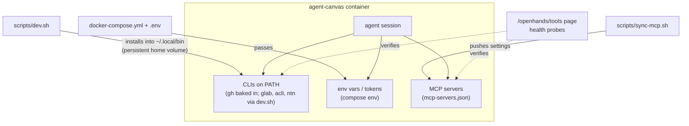

# Adding tools — giving the agent new capabilities

"Tools" here means anything the agent can *use* inside its sandbox: CLIs, MCP servers,
credentials, and environment. Almost all of it is **infra-level** (compose + `dev.sh`), not
app code — you can substantially upgrade your agent without touching TypeScript.

## The three channels



## 1. CLIs

The agent-canvas image ships `gh` (GitHub CLI). Extra CLIs are installed by `scripts/dev.sh`
at stack start, with a pattern worth copying:

- **Install into `~/.local/bin`** inside the container — that's the persistent `openhands-home`
  volume, so the binary survives container recreates.
- **Symlink onto `/usr/local/bin` as root each start** — the symlink target is image-layer
  (lost on recreate), so relinking is done every boot; it's cheap and idempotent.
- Detect arch (`aarch64|arm64` vs `x86_64`), fail soft (`|| true`) — a missing optional CLI
  must never block the stack.

Existing examples in `dev.sh`: `glab` (GitLab CLI, from GitLab releases), `acli`
(Atlassian CLI, with idempotent `jira auth login` when the `ATLASSIAN_*` env trio is set)
and `ntn` (Notion CLI, via its official npm package — the image ships node 22; it auths
from `NOTION_API_TOKEN` with no login step).
**To add a CLI**: copy one of those blocks, adjust the download URL/arch mapping, and add a
health probe to the Tools page if it matters (see §4).

## 2. Credentials & environment

Tokens reach the agent via compose env (`docker-compose.yml` reads `.env`):

| Env | Grants the agent |
|---|---|
| `OPENHANDS_GITHUB_TOKEN` | `gh` auth + https clone/push to github.com (as `GH_TOKEN`/`GITHUB_TOKEN`) |
| `OPENHANDS_GIT_TOKEN` / `GITLAB_TOKEN` | git askpass answers for GitLab clones/pushes |
| `ATLASSIAN_SITE/EMAIL/API_TOKEN` | `acli` Jira/Confluence |
| `NOTION_API_TOKEN` | `ntn` Notion CLI (integration token; share target pages with the integration) |

Two rules:

- **Scope tokens to what agents should reach** — a token in the container is usable by *any*
  conversation (single-tenant, shared container). Fine-grained PATs over classic.
- **Never bake a token into the image or compose file** — `.env` only (gitignored), documented
  in `.env.example`.

## 3. MCP servers

[MCP](https://modelcontextprotocol.io) servers give the agent structured tool APIs (Notion,
Slack, browsers, databases…). Flow:

1. `cp mcp-servers.example.json mcp-servers.json` (gitignored).
2. Add server entries (command/args/env per the MCP spec — same shape the OpenHands
   agent-server accepts in its settings).
3. `bash scripts/sync-mcp.sh` (also runs on every `dev.sh` start) pushes the config into
   agent-canvas settings.
4. Verify on `/openhands/tools` — health/status probes surface broken servers.

Secrets for MCP servers follow rule §2: env-substituted from `.env`, never committed.

### Example: Playwright MCP (opt-in browser automation)

`mcp-servers.example.json` ships an **opt-in** `playwright-mcp` entry using Microsoft's
official [`@playwright/mcp`](https://github.com/microsoft/playwright-mcp) server over stdio.
Like every entry in that file it only takes effect once you copy it into your gitignored
`mcp-servers.json` (§3 step 1) and run `sync-mcp.sh` — nothing here is enabled by default:

```json
"playwright-mcp": {
  "transport": "stdio",
  "command": "npx",
  "args": [
    "-y",
    "@playwright/mcp@latest",
    "--headless",
    "--isolated",
    "--no-sandbox"
  ]
}
```

Flags chosen for a noninteractive agent container (all documented in the
[playwright-mcp README](https://github.com/microsoft/playwright-mcp#configuration)):

- **`--headless`** — no display server in the container; runs Chromium headless
  (`PLAYWRIGHT_MCP_HEADLESS` env equivalent).
- **`--isolated`** — keeps the browser profile in memory instead of writing a persistent
  profile to disk; each agent run starts clean and nothing about prior sessions leaks
  between conversations sharing the container.
- **`--no-sandbox`** — Chromium's OS sandbox needs privileges (`CAP_SYS_ADMIN` or similar)
  that a container often doesn't grant; this is the same flag the project's own
  [Docker example](https://github.com/microsoft/playwright-mcp#docker) uses. It trades
  process-level sandboxing for compatibility — see **Security implications** below.
- `-y` avoids the npx "ok to install?" interactive prompt, matching the noninteractive
  server context.
- `@latest` resolves the npm **stable** dist-tag (0.0.79 at the time of writing), never the
  `next` alpha builds. Pin an exact version (`@playwright/mcp@0.0.79`) if you want the agent's
  tool surface to stop moving underneath you — the tool list does change between releases.

**Prerequisites — verify before assuming zero setup:**

- **Node.js** — the agent-canvas image ships Node (this repo's own image is `node:22-slim`),
  so `npx` is available; no extra install for the CLI wrapper itself.
- **Chromium browser binary** — `npx @playwright/mcp@latest` does **not** bundle a browser.
  On first run it either finds a Playwright-managed Chromium already cached
  (`~/.cache/ms-playwright/`) or downloads one (~150–300 MB) via
  `npx playwright install chromium` / `--with-deps` for OS-level libs
  (fonts, `libnss3`, etc.). **Do not assume the `agent-canvas` image bundles this** — check
  with `docker compose exec openhands npx playwright install chromium --dry-run` (or `ls
  ~/.cache/ms-playwright/` inside the container) before relying on it; if missing, the first
  MCP tool call will trigger a download (slow, needs network egress) or fail in a fully
  offline container. Pre-warming the cache (baking `npx playwright install --with-deps
  chromium` into a custom image layer, or a one-time `dev.sh` step) is the fix if that
  matters for your setup — this repo does not do it by default, since the base tool is
  opt-in.
- **Disk/network egress** — npx resolves `@playwright/mcp@latest` from the npm registry each
  cold start (cached afterward per the container's npm cache); the browser download above
  needs its own egress the first time.

**Security implications:**

- Per the upstream README: *"Playwright MCP is not a security boundary."* It grants the
  agent a real, scriptable browser — any workflow that visits attacker-influenced URLs
  should treat this the same as giving the agent unrestricted internet access via a UI.
- `--no-sandbox` further weakens Chromium's own process-level isolation (the OS sandbox that
  normally contains a compromised renderer process) — acceptable inside the already-isolated
  `agent-canvas` container, but do not run it this way outside a container/VM boundary.
- `--isolated` means no persistent cookies/logins survive between agent runs by design —
  good default for an untrusted/shared agent container.  If you need authenticated sessions,
  add `--storage-state <path>` explicitly (loads a specific, curated session) rather than
  dropping `--isolated` for the default persistent profile.
- Treat it like any other MCP server for scope: it runs inside the single-tenant container,
  so any conversation on that container can drive the browser.

**Verification:**

1. `cp mcp-servers.example.json mcp-servers.json` (or add the `playwright-mcp` block to an
   existing one), then validate the JSON before syncing:
   `node -e 'JSON.parse(require("fs").readFileSync("mcp-servers.json","utf8"))'`.
2. `bash scripts/sync-mcp.sh` — it prints `sync-mcp: playwright-mcp -> POST/PATCH <status>`
   per entry (and exits quietly if the agent API key isn't written yet).
3. Open `/openhands/tools` and confirm `playwright-mcp` reports the same healthy status as
   any other MCP entry — that is the "did the agent actually get it" check (§4).
4. End-to-end: ask an agent to navigate to a page and take a snapshot. Only this exercises
   npx resolution *and* the Chromium binary; a clean process launch alone does not prove the
   browser is installed.

## 4. Surfacing tool health in the UI

The Tools page (`client/pages/Tools.tsx` + endpoints in `setup.ts`) probes what the agent
actually has: agent-server reachability, CLI presence, MCP status. When you add a tool an
agent workflow *depends on*, add a probe — "the agent silently lacks `glab`" is exactly the
kind of failure that burns an hour. Pattern: BFF endpoint runs the check (e.g.
`docker compose exec`-equivalent via the agent API or a version probe), page renders
green/red.

## 5. App-level tools (BFF capabilities)

Different beast: features the *app* offers around conversations (MR panel, terminal audit,
preview proxy) live in the BFF — that's [extending.md](extending.md) § "Add a BFF endpoint",
with [risk-map.md](risk-map.md) implications since these often touch tokens or proxy
surfaces.

## Checklist for a new tool

- [ ] Install path survives container recreation (home volume) — or is re-run each start
- [ ] Works on both arm64 and amd64 (or degrades gracefully)
- [ ] Token scoped, in `.env`, documented in `.env.example`
- [ ] Health visible on the Tools page if workflows depend on it
- [ ] `AGENTS.md` note if agents should *know* they have it
