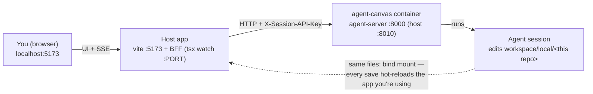
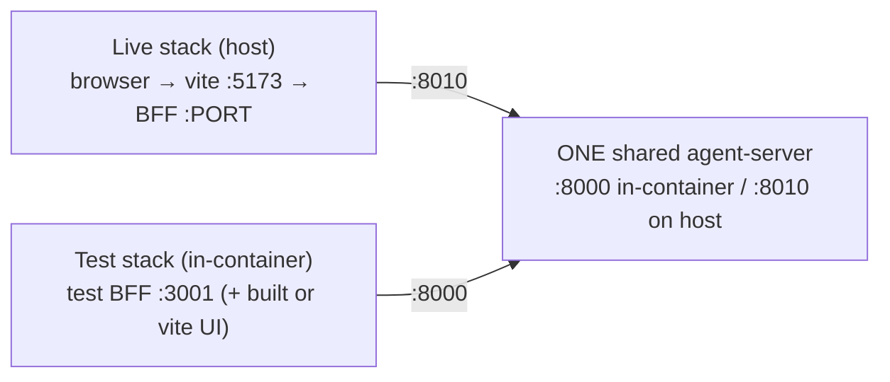

# Agent sessions — the app improving itself

This app can be developed **by the agent it hosts**: point a conversation at this repo as a
local-folder workspace and the agent edits the same working tree your running instance serves.
This page explains the loop, its one big caveat, and how an agent tests changes in parallel
without disturbing the session you might be reading this in.

> `AGENTS.md` at the repo root is the terse, agent-facing version of this page (it's loaded
> into every session as repo memory). This doc is the long-form human explanation. Keep both
> updated when workflows change.

## The self-development loop



Because the working tree is shared:

- A BFF restart (tsx watch picking up a server edit) briefly drops the transcript's SSE
  stream — but the conversation lives in the agent-server and survives; the UI reconnects.
- **The caveat**: `git checkout` inside the workspace switches the code your live UI is
  running *right now*. Risky or branch-based work must use a **worktree** instead:

```bash
git worktree add ~/worktrees/<name> -b <branch>
ln -s <repo>/node_modules ~/worktrees/<name>/node_modules
```

The live checkout stays on `main`; the branch work happens in the worktree sharing the same
`.git` history. Push over https with the in-container token
(`git push https://github.com/<owner>/<repo>.git <branch>`), PRs via `gh pr create` — the
origin's ssh URL is unusable in-container (no ssh binary).

## Testing in parallel with a live session

There is no docker socket inside the container, so the agent cannot compose up a second agent
stack — and it doesn't need to. One agent-server serves any number of app instances:



A test BFF inside the container:

```bash
PORT=3001 OPENHANDS_INTERNAL_URL=http://localhost:8000 \
OPENHANDS_API_KEY_FILE=/home/openhands/.openhands/agent-canvas/api-key.txt \
PGHOST= npx tsx server/index.ts
```

For UI work, either serve a `vite build` from that test BFF, or run vite with
`VITE_BASE_PATH=<live-preview base>` (`/api/openhands/conversations/<id>/preview/<port>/`)
and `VITE_ALLOWED_HOSTS=all` — `vite.config.ts` has explicit support — then view it through
the live app's preview proxy. No second docker stack, no port remapping.

## Test tiers available to an agent

| Tier | Where | Notes |
|---|---|---|
| `npm run typecheck` | in-container | no ports at all |
| `npx vitest run` | in-container | no ports at all |
| second BFF on `:3001` | in-container | shares the live agent-server via `:8000`; api-key file readable at the path above |
| test UI | in-container | vite with the preview base, or a built UI served by the test BFF |
| Playwright e2e | host (or in-container after `npx playwright install chromium`, ~110 MB) | the suite manages its own app server on `PORT`; good for scripted screenshots too |

The shared `node_modules` works on both sides of the bind mount — it carries esbuild binaries
for the host (darwin-arm64) and the container (linux-arm64).

## In-container quirks

- No `file` binary: verify image magic bytes with python before opening screenshots.
- No ssh: push over https with the token; `gh` is authenticated when
  `OPENHANDS_GITHUB_TOKEN` is set.
- `npm install` under the container's npm version can churn `package-lock.json` (`libc`
  fields) — revert no-op drift instead of committing it.

## Shipping

Changes ship like any other repo: worktree branch → commit → push → PR; checks per
[testing.md](testing.md); risk awareness per [risk-map.md](risk-map.md). For orchestrating
*several* agents on this repo at once, see the manager-runs guide in the app
(`/openhands/manager-guide`).
