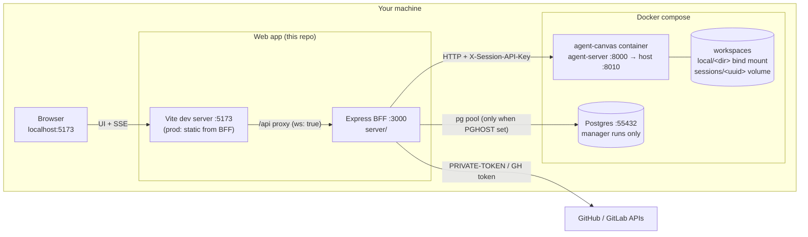
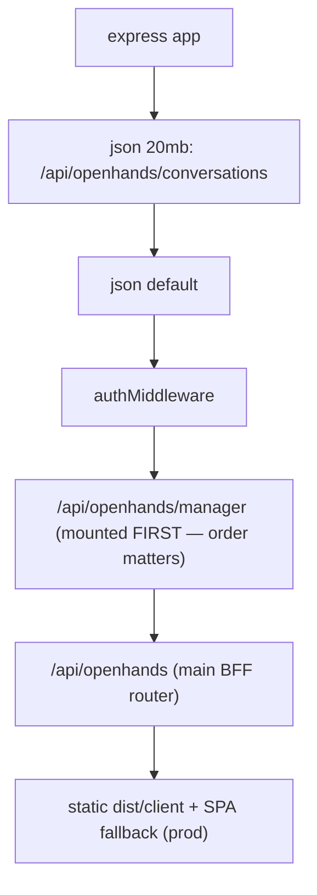
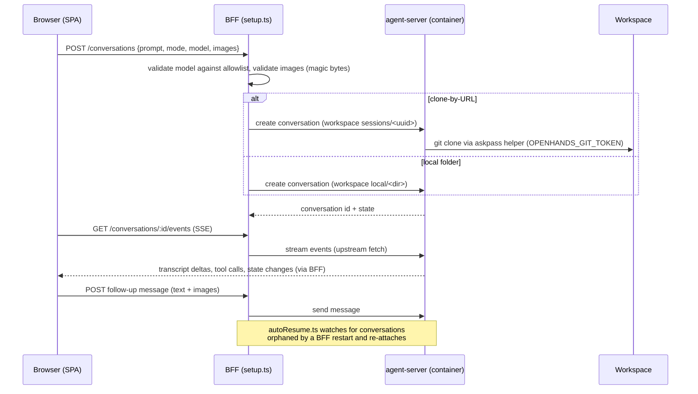

# Architecture

What this app is: a **BFF (backend-for-frontend) + SPA** wrapped around a headless
[OpenHands agent-server](https://docs.openhands.dev) running in the
`ghcr.io/openhands/agent-canvas` container. The BFF owns every credential; the browser
never talks to the agent-server directly.

## Topology

Key properties:

- **Single-tenant by design.** One user (`dev@local`), one agent container, one git identity.
  Conversations get separate working directories but share the container.
- **The BFF is the security boundary.** The agent-server API key is read server-side
  (`server/openhands/upstream.ts`) from `./.state/agent-canvas/api-key.txt` (a bind mount of
  the container's `~/.openhands`) and attached as `X-Session-API-Key`. It never reaches the client.
- **Two workspace modes.** Local folders under `OPENHANDS_PROJECTS_DIR` are bind-mounted to
  `/home/openhands/workspace/local/`; clone-by-URL conversations live in
  `sessions/<uuid>` inside the `openhands-home` docker volume.

## Server composition

`server/index.ts` (~75 lines) is the whole entry point:

1. Raised 20 MB `express.json` limit for `/api/openhands/conversations` (chat image uploads) —
   registered **before** the global 100 kB parser.
2. `authMiddleware()` (`server/auth.ts`) — oauth2-proxy-header shape, defaulting to `dev@local`.
3. Optional Postgres pool when `PGHOST` is set → enables manager runs.
4. `setup()` (`server/openhands/setup.ts`, ~2 800 lines — the heart of the BFF) returns routers:
   - `/api/openhands/manager` — manager-runs router, **mounted first** (it has its own
     fail-closed gate; mounting after the main router would shadow it).
   - `/api/openhands` — everything else: conversations, events (SSE), files, diffs, git,
     terminal audit, preview proxy, MR viewer, disk usage.
5. Prod-only static serving of `dist/client` + SPA fallback.

## Conversation lifecycle

The conversation itself **lives in the agent-server** — the BFF is stateless about transcripts.
That is why a BFF restart (hot reload in dev) only drops the SSE stream briefly; the UI
reconnects and replays.

## Live preview proxy

Agents often start dev servers inside the container. The BFF reverse-proxies them at
`/api/openhands/conversations/<id>/preview/<port>/…` so the browser can view them without any
container port mapping. Because that base path starts with `/api/`, the Vite dev proxy has a
bypass rule for it (`vite.config.ts`) — without it, Vite would proxy the preview UI's own
assets to the BFF.

## Manager runs

A manager conversation orchestrates parallel worker conversations. State (runs, workers,
activity) is in Postgres (`server/openhands/manager/store.ts`, idempotent inline DDL). The
monitor loop (`monitor.ts`) polls worker conversations and advances the run state machine;
`executor.ts` starts/steers workers via the same upstream client. Feature is cleanly disabled
when `PGHOST` is unset.

## Notifications

`server/openhands/notifier.ts` posts to [ntfy](https://docs.ntfy.sh) on conversation
transitions (finished / error / stuck / awaiting input). Browser-side chime + desktop
notifications are client-only (`client/lib/useNotifyWatcher.ts`, Web Notifications API) —
deliberately no server↔OS coupling (decision #10).

## Where it came from

Extracted from an internal developer-platform codebase (with written approval to publish);
thin platform couplings (auth, logger, GitLab client, DB pool, client shell/design system)
were replaced by local equivalents. Durable choices are in [decisions.md](decisions.md).
