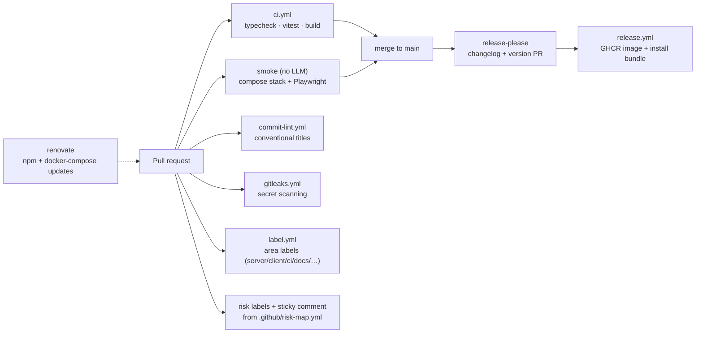

# CI/CD

GitHub Actions, free tier, no deploy target — this is a local-first app, so "CD" means
release hygiene, not shipping servers. The pipeline's job is to keep `main` green, keep
dependencies moving, and make **per-PR risk visible**.

> **Status:** the pipeline lands via the `ci/pipeline` branch (checks, smoke, commit-lint,
> gitleaks, area labeler, release-please) plus a follow-up adding the risk-dimension job.
> Renovate arrives via its own PR. If `.github/workflows/` is missing pieces on your checkout,
> that work is still in flight — this doc is the spec they implement.

## Pipeline at a glance

## Workflows

| Workflow | Trigger | What it does |
|---|---|---|
| `ci.yml` | PR + push to main | `npm ci` → `typecheck` → `vitest run` → `build`; smoke job boots the compose stack (agent-canvas, **no LLM key needed**) and runs the Playwright suite; on PRs it also runs the `@shots` screenshot harness and maintains a sticky comment linking the `pr-screenshots` artifact (advisory — `continue-on-error`, never gates; see [testing.md](testing.md)) |
| `commit-lint.yml` | PR | enforces conventional-commit titles (`feat:`, `fix:`, `docs:`, `ci:`) — release-please depends on them |
| `gitleaks.yml` | PR + push | secret scanning; this repo's whole threat model is "tokens in `.env`", so leaks are the #1 CI catch |
| `label.yml` | PR | area labels from `.github/labeler.yml` (server / client / ci / docs / tests / infra) |
| risk labels | PR | reads [`.github/risk-map.yml`](../.github/risk-map.yml), matches changed files, applies `risk:<dimension>-<level>` labels for every `high` hit, and maintains **one sticky comment** with the touched-areas dimension table |
| `release-please.yml` | push to main | maintains a running release PR (changelog from conventional commits, version bump) |
| `release.yml` | called by release-please on release creation (+ manual dispatch / manual releases) | single-click package: multi-arch app image → GHCR, `install.sh` + compose bundle → release assets (see [packaging.md](packaging.md)) |
| renovate | schedule | dependency PRs for npm + the pinned `agent-canvas` image in docker-compose |

## Per-PR risk labels

The interesting part. Mechanics:

1. The job diffs the PR's changed files.
2. Each file is matched against `areas:` glob lists in `risk-map.yml` (first match wins).
3. Per dimension (security / stability / blast / cost) the **max** level across touched areas
   is computed.
4. `high` maxes become labels (`risk:security-high`, `risk:cost-high`, …); the sticky comment
   shows the full table either way.

What reviewers do with it: a `risk:security-high` PR gets a diff-level read of the sensitive
files; a docs-only PR (all-low) can merge on green checks. Rationale per area:
[risk-map.md](risk-map.md).

## Conventions for CI changes

- **Pin third-party actions** to a major tag at minimum (`actions/checkout@v4`); prefer SHAs
  for anything with repo-token access.
- **No `pull_request_target`** unless you can explain, in the PR description, why it's safe.
- Keep jobs **free-tier frugal**: the smoke job is the expensive one (multi-GB agent-canvas
  image pull) — keep it path-filtered away from docs-only PRs and let the cheap checks run
  everywhere.
- CI files are on the [risk map](risk-map.md) as `security: medium` — workflows run with a
  repo token; treat workflow diffs from unfamiliar sources accordingly.

## Adding a job

1. New workflow file in `.github/workflows/`, smallest possible `permissions:` block.
2. Add a row to the table above (this doc is the pipeline's documentation of record).
3. If it changes what merges may assume about `main`, note it in [testing.md](testing.md) too.

## Releases

release-please maintains version + `CHANGELOG.md` from conventional-commit titles and cuts a
GitHub Release when its running PR merges. Its workflow then **calls `release.yml` directly**
(`workflow_call`) rather than relying on an `on: release` trigger — releases created with the
repo `GITHUB_TOKEN` do not fire event-triggered workflows, so an event trigger alone would
silently never run.

`release.yml` turns the tag into the **single-click package**: a multi-arch app image on GHCR
plus `install.sh` and a compose bundle attached to the release. What is in those artifacts, how
users install them, the maintainer checklist (bot-run approval, GHCR package visibility,
`:edge` dry runs) and the post-release verification recipe all live in
[packaging.md](packaging.md).

Developer deploys need none of it: `git pull && npm run build && node dist/server/index.js`.
