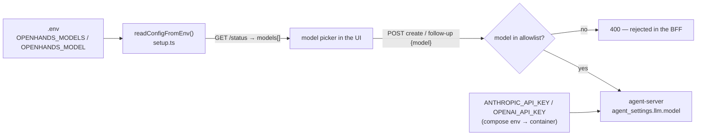

# LLMs — models, keys, and spend control

All model configuration is **environment-only** (no config files) and enforced in the BFF.
The agent-server does the actual LLM calling; this app decides *which models are offered* and
*which keys the container gets*.

## How model selection flows

- `OPENHANDS_MODEL` — the default (falls back to `anthropic/claude-sonnet-5`).
- `OPENHANDS_MODELS` — comma-separated allowlist shown in the UI; first entry is the default.
  Unset ⇒ a built-in `anthropic/*` list (`DEFAULT_MODELS` in `setup.ts`).
- The allowlist is a **cost/policy gate, enforced server-side**: create and follow-up requests
  with a model outside it are rejected with 400 regardless of what the client sends.

## Per-message model switching

Follow-ups can carry a different model. The BFF updates the conversation's LLM with
`usage_id = model id`, so the agent-server **reuses a cached LLM per model** instead of
minting duplicates when you switch back and forth (see the comment around the follow-up
handler in `setup.ts`). Practical pattern: draft and iterate on `haiku`, switch a final
message to `sonnet`/`opus`.

## Provider keys

| Env | Notes |
|---|---|
| `ANTHROPIC_API_KEY` | primary; the default models are `anthropic/*` |
| `OPENAI_API_KEY` | optional, enables `openai/*` models in your allowlist |
| `OPENAI_BASE_URL` | **EU-data-residency keys 401 against the default endpoint** — set `https://eu.api.openai.com/v1` (decision #8) |

Keys go to the **container** via compose env — the browser never sees them; the BFF never
proxies raw LLM traffic.

## Adding a provider or model

1. Add the model id(s) to `OPENHANDS_MODELS` (LiteLLM-style `provider/model` ids — whatever
   the OpenHands agent-server version supports).
2. Provide the provider's key via compose env (`docker-compose.yml` env section reads `.env`).
3. If the provider needs a base-URL or region override, thread it through the same way
   `OPENAI_BASE_URL` is threaded.
4. Update `.env.example` — it is the config reference.

## Spend control

Where money can leak, and what guards it:

| Path | Guard |
|---|---|
| arbitrary model requests from the UI | server-side allowlist (400s) |
| runaway parallel workers | manager runs are Postgres-gated, monitored (`manager/monitor.ts`); worker count is bounded per run — see the [risk map](risk-map.md) `cost: high` rows |
| auto-resume after BFF restarts | `autoResume.ts` re-attaches rather than restarts; disable outright with `OPENHANDS_AUTO_RESUME=0` |
| committed test suites | **LLM-free by design** (decision #9) — `npm test` / `test:e2e` can never spend |
| default model choice | keep a cheap default (`haiku`) in `OPENHANDS_MODELS` first slot if you iterate a lot |

There is no in-app budget meter — spend tracking lives with your provider console. If a fork
adds one, the natural seam is the BFF (it sees every create/follow-up + model choice).
