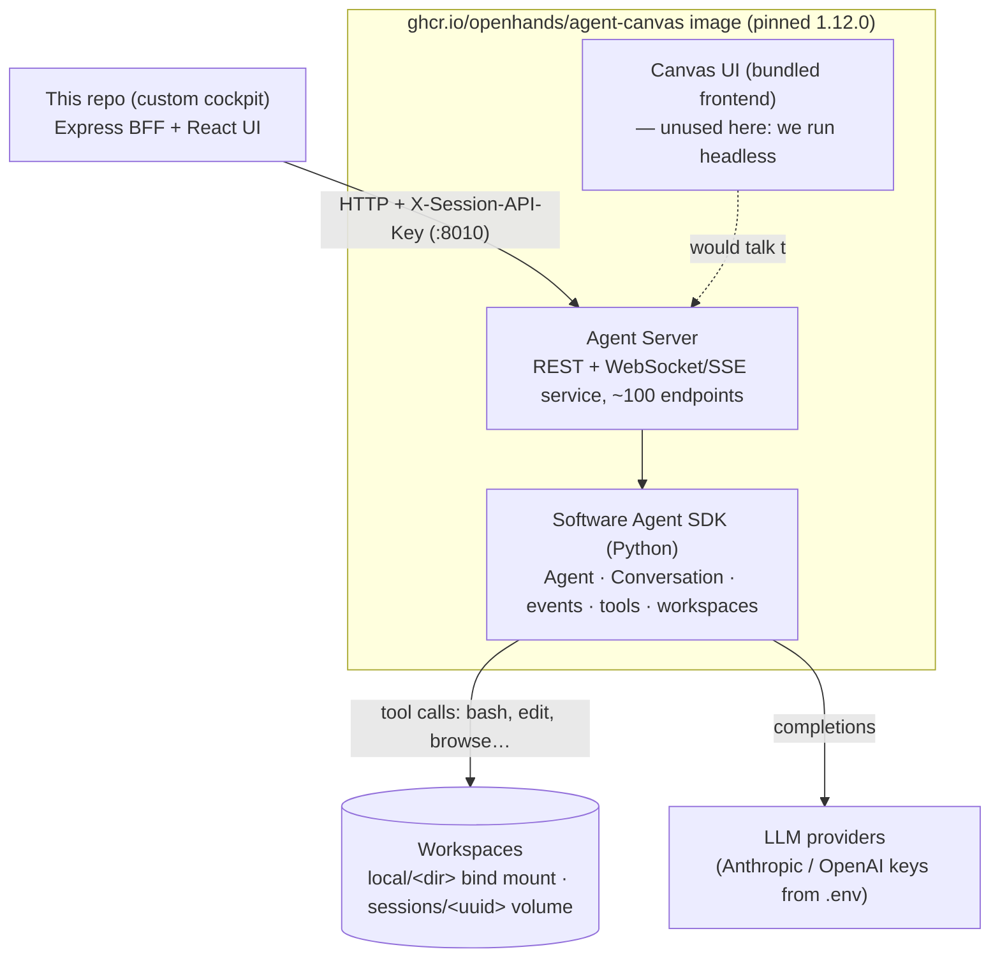

# How OpenHands works

This app is a custom cockpit; **OpenHands** is the engine. This page explains the engine —
the layers inside the `agent-canvas` container, what an "agent session" actually is, and
where the official docs go deeper on each piece.

## The layer cake

- **[Software Agent SDK](https://docs.openhands.dev/sdk)** — the core: an `Agent` (LLM +
  tools + system prompt) driving a `Conversation` (durable event log + state machine) inside
  a workspace. Everything you see in this app's transcript — tool chips, file edits, bash
  commands — is a rendering of SDK **events**.
  Start at [SDK Getting Started](https://docs.openhands.dev/sdk/getting-started).
- **[Agent Server](https://docs.openhands.dev/sdk/guides/agent-server/overview)** — the SDK wrapped in
  a REST/WebSocket service. This is what our BFF talks to on `:8010`. Conversations created
  over HTTP persist server-side and stream events out.
- **[agent-canvas](https://github.com/OpenHands/agent-canvas)** — the all-in-one open-source
  distribution ("start locally, connect your tools, automate workflows"): agent-server plus a
  bundled canvas UI, in one container image. **We run it headless** — this repo's UI is the
  only frontend; the bundled one is simply never exposed
  (compare: the stock [local GUI setup](https://docs.openhands.dev/openhands/usage/run-openhands/local-setup)).

## What an "agent session" is

A conversation on the agent-server is a durable object, independent of any UI:

- **State machine** — `execution_status` (running / finished / awaiting input / error…),
  confirmation policy, iteration limits.
- **Event log** — every user message, LLM step, tool call and observation, appended and
  replayable. This is why our UI can reconnect its SSE stream after a BFF restart and lose
  nothing: the conversation *lives in the agent-server*, the BFF is stateless about it.
- **A workspace** — the working directory the agent's tools operate in. Our two modes
  (local bind mount / clone-by-URL) are just different workspace paths
  (see [architecture.md](architecture.md)).
- **Persistence on disk** — under the container's home:
  `.state/agent-canvas/conversations/<id>/` on this host. Conversations survive container
  restarts too.

Concepts in depth: [Conversations & events](https://docs.openhands.dev/sdk/arch/conversation).

## Plan mode (Build vs Plan)

Plan mode mirrors Claude Code's `plan` permission mode / opencode's `plan` agent: research
first, writes gated. It is built entirely on the agent-server's confirmation machinery — no
custom sandboxing:

| | Build | Plan |
|---|---|---|
| `confirmation_policy` | `NeverConfirm` | `ConfirmRisky { threshold: MEDIUM, confirm_unknown: true }` |
| `security_analyzer` | — | `LLMSecurityAnalyzer` (the LLM risk-labels each action) |
| Read-only actions (LOW) | run | run |
| Writes / state changes (MEDIUM+ or unlabeled) | run | park in `waiting_for_confirmation` → Approve/Reject in the UI |

The mode IS the upstream policy (`server/openhands/planMode.ts`,
`client/lib/planMode.ts` derive it from `confirmation_policy` on the conversation), so
nothing can drift. Plan conversations also get a task preamble instructing the agent to end
with a reviewable plan. "Approve plan & build" switches the policy to `NeverConfirm` via
`POST /api/conversations/{id}/confirmation_policy` and sends a canned "implement it"
message — same conversation, no restart. The plain toggle (`POST
/api/openhands/conversations/:id/mode`) flips either way mid-run, like Shift+Tab in Claude
Code.

## Explore it live on your machine

The stack you're running self-documents — the fastest way to understand the engine is to poke it:

| What | Where |
|---|---|
| **Swagger UI** — the full agent-server API, interactive | `http://localhost:8010/docs` |
| API key for real calls | `cat .state/agent-canvas/api-key.txt` → send as `X-Session-API-Key` |
| List your conversations as raw objects | `curl -s http://localhost:8010/api/conversations/search -H "X-Session-API-Key: $(cat .state/agent-canvas/api-key.txt)" \| jq` |
| A session's durable state on disk | `.state/agent-canvas/conversations/<id>/` |
| The agent's world from inside | `docker compose exec openhands bash` |

Then read `server/openhands/` in this repo as a **curated tour of the same API** — it shows
which endpoints a real client needs for lifecycle, SSE events, files/diffs, and confirmations
(`upstream.ts` is the 60-line authenticated core).

## Official docs index

| Topic | Link |
|---|---|
| OpenHands overview & products | [docs.openhands.dev](https://docs.openhands.dev) |
| SDK getting started | [docs.openhands.dev/sdk/getting-started](https://docs.openhands.dev/sdk/getting-started) |
| SDK architecture | [docs.openhands.dev/sdk/arch/overview](https://docs.openhands.dev/sdk/arch/overview) |
| Agent Server guide | [docs.openhands.dev/sdk/guides/agent-server/overview](https://docs.openhands.dev/sdk/guides/agent-server/overview) |
| Conversations & events | [docs.openhands.dev/sdk/arch/conversation](https://docs.openhands.dev/sdk/arch/conversation) |
| Stock local GUI (what this app replaces) | [local setup](https://docs.openhands.dev/openhands/usage/run-openhands/local-setup) |
| Source: SDK + agent-server | [github.com/OpenHands/software-agent-sdk](https://github.com/OpenHands/software-agent-sdk) |
| Source: agent-canvas distribution | [github.com/OpenHands/agent-canvas](https://github.com/OpenHands/agent-canvas) |

## How this repo relates (and diverges)

| Stock OpenHands | This app |
|---|---|
| Canvas/GUI frontend bundled in the image | Own React UI; container runs headless |
| One user drives one conversation at a time | Manager runs orchestrate parallel workers |
| Workspace per conversation | Same, plus first-class **local folder** mode onto your projects dir |
| API key handled by its own frontend | Key never leaves the BFF (`upstream.ts`) |
| Version moves with upstream releases | Image **pinned** (decision #7; update policy deliberately manual) |

When upgrading the pinned image, re-check the endpoints `server/openhands/setup.ts` uses
against the new Swagger — that contract is the app's foundation
([risk map](risk-map.md): high stability/blast).
