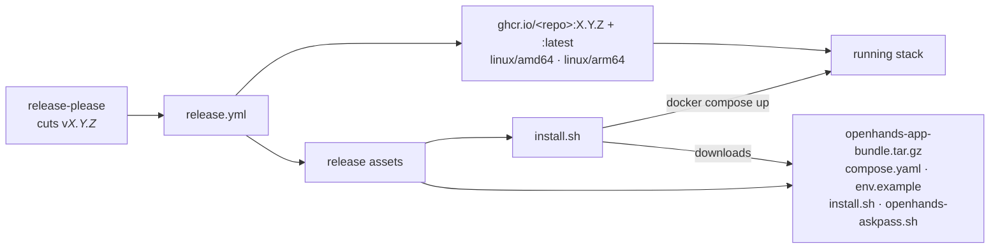
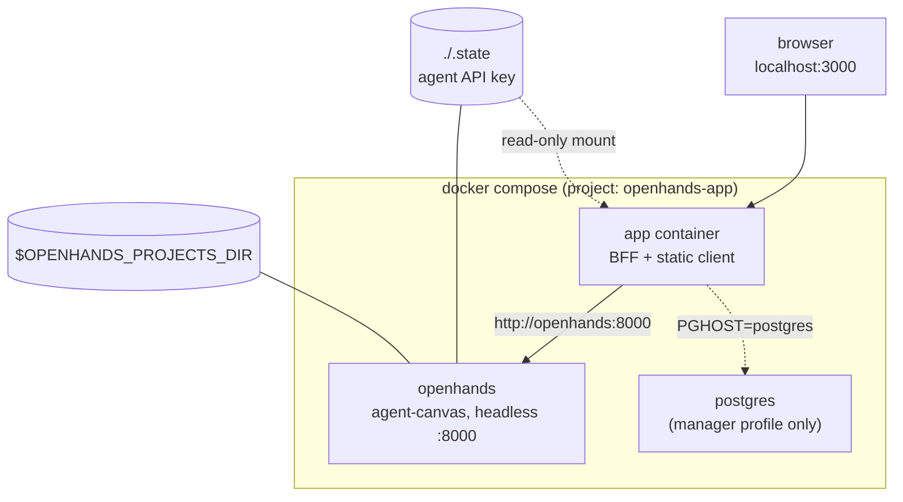

# Packaging & install — the single-click distribution

> **Status: beta.** The release installs and the stack comes up, but the packaged app is
> **not at parity with the dev stack yet** — several core flows are broken or unverified in
> the container (see [Known limitations](#known-limitations-beta)). Treat the package as a
> preview: fine for trying the app out, not yet the recommended way to do real work. For that,
> run the [development stack](../CONTRIBUTING.md) — it is the supported path.

There are two ways to run this app, and they exist for different people:

| | Development (`scripts/dev.sh`) | **Package** (this page) |
|---|---|---|
| Needs | Node ≥ 22 + Docker + a checkout | **Docker only** |
| Runs | app on the host (tsx watch + vite), agent in docker | everything in docker compose |
| Ports | UI :5173, API :3000, agent :8010 | one port (:3000) — agent is internal |
| Edits | hot-reload | pull a new image |

The package is produced by CI from a tagged release: a container image plus a small compose
bundle attached to the GitHub Release. Nothing is built on the user's machine.

## What ships



- **Image** (`Dockerfile`) — multi-stage: `npm ci` → `npm run build` (vite + server tsc) →
  `npm prune --omit=dev`, then a slim runtime layer carrying `dist/` + prod `node_modules`.
  Runs `node dist/server/index.js` with `NODE_ENV=production`, which serves the built client
  and the API from one process. Healthcheck polls `/api/openhands/status`.
- **Bundle** — everything needed to run that image: the compose file, the env template, the
  installer itself (so re-running is self-contained), and the git askpass helper the agent
  container mounts.

## Packaged topology



Differences from the dev stack, and why:

| Concern | Dev (`dev.sh`) | Package | Why |
|---|---|---|---|
| Agent URL | `http://localhost:8010` (published port) | `http://openhands:8000` | no host port needed; the agent stays off the host network |
| Agent key | `./.state/agent-canvas/api-key.txt` on the host | same dir, mounted **read-only** into the app | the app's only filesystem dependency ([architecture.md](architecture.md)) |
| Workspace ownership | `dev.sh` runs `chown` after compose up | compose `post_start` hook | the projects bind mount makes docker create `workspace/` as root, blocking uid 10001 |
| Agent profile defaults | `scripts/sync-agent-settings.sh` | app entrypoint runs the same `scripts/seed-agent-settings.mjs`, polling (`SEED_WAIT_SECONDS`) until the agent mints its key | one implementation; the container starts in parallel with the agent |
| Identity | `dev@local` fallback (non-production) | `NODE_ENV=production` **plus** explicit `ALLOW_DEV_AUTH=true` | production build, but still a single-user local app — see `server/auth.ts` |
| Exposure | vite on all interfaces | published on `127.0.0.1` unless `OPENHANDS_BIND` says otherwise | with a single-user identity, port reachability *is* the auth boundary |

Local-folder conversations are wired the same way as in dev: `OPENHANDS_PROJECTS_DIR` is
bind-mounted into the **agent** container at `/home/openhands/workspace/local`, and the BFF lists
it through the agent-server API rather than reading the host disk. In the package that path is
not yet reliable — see below.

## Known limitations (beta)

The package is **not at parity with `scripts/dev.sh`**. What is known to work, from the
[verification recipe](#verifying-a-release): the installer runs, both containers come up healthy,
the SPA is served, the agent mints its key, the settings seed lands, and a fresh conversation can
be created and answered. Beyond that, these are the open gaps:

| Area | Symptom in the package | Notes / workaround |
|---|---|---|
| **Project folder picking** | The local-folder picker in the new-task form comes up empty or the chosen folder doesn't become the working directory, so "work on an existing project" is effectively unavailable. | `OPENHANDS_PROJECTS_DIR` must be an **absolute** host path in `.env` (compose does not expand `~`) and the folders must be its *immediate* subdirectories. Confirm the mount with `docker compose exec -T openhands ls /home/openhands/workspace/local` and the API with `curl -s localhost:$PORT/api/openhands/local-folders`. If the mount looks right and the list is still empty, it's this bug. |
| **Conversation recovery** | After `docker compose restart`/`up -d` (including the update path), existing conversations don't reliably come back — the list, the transcript, or auto-resume of an interrupted run can all be affected. | Auto-resume (`server/openhands/autoResume.ts`) was written for a Kubernetes rollout, where only the agent-server restarts; a compose update restarts the app *and* the agent, which is a case it doesn't handle cleanly. Prefer finishing runs before updating. |
| **Updates** | Re-running `install.sh` is the documented update path, but it has never been exercised across a real version bump with existing conversations. | History lives in the `openhands-home` volume, which the update path leaves alone — so the risk is downtime, not data loss. Just never `down -v`. |
| **Everything not in the recipe** | Preview proxy, MR panel, manager runs, ntfy, and the git integrations are configured in the packaged compose file but are not covered by the release verification. | Assume "unverified", not "broken". |

Consequences for users and contributors:

- **Use the [development stack](../CONTRIBUTING.md) for real work.** It is what CI exercises and
  what every other page in this section documents.
- **Report packaging bugs against the package**, with `docker compose logs app` /
  `logs openhands` attached — the dev stack usually behaves differently, so "works in dev" is
  expected and not useful triage.
- **Exit criteria.** Beta ends when local-folder conversations work end-to-end in the container,
  conversations survive a `docker compose up -d`, and the [verification
  recipe](#verifying-a-release) covers both. Dropping the badge then means deleting
  `status: "beta"` from this doc's entry in [client/lib/docs.ts](../client/lib/docs.ts) and
  removing this section — `tests/docs-registry.test.ts` keeps the two in step.

## Install

```bash
curl -fsSL https://github.com/leoncheng57/Customizable-DCA-OpenHands/releases/latest/download/install.sh | bash
```

What `install.sh` does, in order:

1. Verifies `docker`, `docker compose` v2, a running daemon, and `curl`.
2. Downloads and unpacks the bundle into `~/openhands-app` (`OPENHANDS_APP_DIR` to relocate).
3. First run only: copies `env.example` → `.env` and prompts (via `/dev/tty`, so `curl … | bash`
   works) for `ANTHROPIC_API_KEY` and a projects directory, creating the latter.
   Non-interactive? It writes `.env`, tells you to fill it in, and exits 1 — re-run after editing.
4. `docker compose pull` (a few GB the first time — mostly agent-canvas) then `up -d`.
5. Prints the URL.

Re-running is the **update** path: it re-downloads the bundle, keeps your `.env`, and pulls
newer images.

## Configure

`~/openhands-app/.env` — the required pair is at the top, everything else is commented in
`env.example`. Package-specific knobs:

| Var | Default | Effect |
|---|---|---|
| `PORT` | `3000` | host port for the UI+API |
| `OPENHANDS_BIND` | `127.0.0.1` | set `0.0.0.0` to reach it from your LAN/Tailscale — anyone who can reach the port is "the" user |
| `OPENHANDS_APP_VERSION` | `latest` | pin a version (`X.Y.Z`) instead of following latest |
| `OPENHANDS_APP_IMAGE` | GHCR path | point at a fork or a locally built image |
| `COMPOSE_PROFILES=manager` + `PGHOST=postgres` | off | starts the bundled postgres and enables manager runs |

Everything else — models, OpenAI/GitLab/GitHub tokens, ntfy, repo allowlist — behaves exactly as
in [.env.example](../.env.example); the compose file forwards them to the right container.

## Operate

All commands run from `~/openhands-app`:

| Task | Command |
|---|---|
| Logs | `docker compose logs -f app` (or `openhands`) |
| Restart | `docker compose restart app` |
| Stop (keep data) | `docker compose down` |
| Update | re-run `install.sh` |
| Roll back | set `OPENHANDS_APP_VERSION=<older>` in `.env`, then `docker compose up -d` |
| Uninstall | `docker compose down -v` then `rm -rf ~/openhands-app` |

`down -v` deletes the `openhands-home` volume — that's **every clone-by-URL workspace and its
conversation history**. Local-folder projects live on your host disk and are untouched. As in
dev there is no janitor: watch the disk-usage bar and delete old conversations.

## Cutting a release

1. Merge PRs with conventional-commit titles; release-please maintains a running release PR.
2. Merge that PR. Its workflow creates the GitHub Release **and calls `release.yml`
   directly** — releases created with the repo `GITHUB_TOKEN` never fire `on: release`, so the
   chain is explicit ([cicd.md](cicd.md#releases)).
3. `release.yml` builds the tagged ref for amd64+arm64, pushes `:X.Y.Z` + `:latest`, packs the
   bundle, and uploads `install.sh` + `openhands-app-bundle.tar.gz` to the release (~10 min).

Maintainer checklist:

- Bot-authored release PRs need workflow approval — approve the `action_required` runs
  (`gh api -X POST repos/<owner>/<repo>/actions/runs/<id>/approve`) or checks never start.
- **GHCR visibility needs no action on a public repo.** A package pushed by Actions with
  `GITHUB_TOKEN` inherits the repository's visibility, so the image is anonymously pullable from
  the first build — verified against `v0.0.1` with an unauthenticated registry token. (On a
  *private* repo the package is private too, and every user would need `docker login ghcr.io`.)
- `workflow_dispatch` on `release.yml` re-publishes an existing tag (`tag: vX.Y.Z`) or, with an
  empty tag, builds an `:edge` image only — a safe dry run that never touches release assets.
- Assets can be replaced in place (`gh release upload … --clobber`) for a broken installer, but
  that desynchronises them from the tagged source. Prefer a patch release when the fix is code.
 

## Verifying a release

The recipe below caught three real bugs on the first release; run it after any change to
`deploy/`, the `Dockerfile`, or the release workflow. Use a throwaway directory and a port that
is not your dev stack's.

```bash
# 1. install as a user would, into a temp dir
export OPENHANDS_APP_DIR=/tmp/oh-e2e
curl -fsSL https://github.com/<owner>/<repo>/releases/download/vX.Y.Z/install.sh | bash  # writes .env, exits 1
# 2. fill .env (key, projects dir, PORT=3020), re-run the same command
#    NOTE: PORT is COMMENTED OUT in env.example — uncomment it, don't just sed the value,
#    or the stack silently comes up on :3000 and may collide with your dev BFF.
# 3. verify the stack
curl -s localhost:3020/api/openhands/status        # configured:true + server.version
curl -s localhost:3020/api/openhands/local-folders # your seeded project appears
curl -so /dev/null -w '%{http_code}\n' localhost:3020/          # 200 (SPA)
docker inspect --format '{{.State.Health.Status}}' openhands-app-app-1   # healthy
docker compose exec -T openhands ls -ld /home/openhands/workspace        # owned by openhands
docker compose logs app | grep seed-agent                                # PATCH 200 after agent boot
# 4. one real conversation (costs a few cents), then tear down
docker compose down -v && rm -rf /tmp/oh-e2e
```

Step 4 is the only part that needs a real LLM key — it is [testing.md](testing.md)'s Tier 5
applied to the package instead of the dev stack.

## Troubleshooting

| Symptom | Cause & fix |
|---|---|
| `curl: (56) … 404` on the installer or bundle | no release published yet → check the Releases page |
| `denied` / `unauthorized` on `docker compose pull` | only happens if the package is private (it is not, on a public repo) → `gh auth token \| docker login ghcr.io -u <user> --password-stdin` |
| `/dev/tty: Device not configured` | no controlling terminal (CI, nested pipe) — the installer writes `.env` and exits; fill it in and re-run |
| Installer exits "edit .env and set ANTHROPIC_API_KEY" | same as above, or you pressed Enter at the prompt |
| Port already allocated | another stack owns `PORT` (dev.sh defaults to 3000) — set `PORT` in `.env` |
| Status shows `configured:false`, `keySource:none` | the agent hasn't minted its key yet, or `./.state` isn't shared — check `docker compose logs openhands` and that both services mount `./.state` |
| Agent can't create workspaces (permission denied) | the `post_start` chown didn't run (older compose) — `docker compose exec -u root openhands chown openhands:openhands /home/openhands/workspace` |
| Live-draft streaming missing | `llm.stream` never got seeded — check `docker compose logs app \| grep seed-agent`; the seed gives up after `SEED_WAIT_SECONDS` |
| Local-folder picker empty / wrong working dir | check `OPENHANDS_PROJECTS_DIR` is absolute and the mount is populated (`docker compose exec -T openhands ls /home/openhands/workspace/local`); if it is, this is the known beta gap — [Known limitations](#known-limitations-beta) |
| Conversations missing or stuck after a restart/update | known beta gap — [Known limitations](#known-limitations-beta); `docker compose logs app` around boot shows what the BFF found |

## Files

| Path | Role |
|---|---|
| `Dockerfile`, `.dockerignore` | the app image |
| `deploy/app-entrypoint.sh` | backgrounds the settings seed, then execs the server |
| `deploy/compose.yaml` | the packaged stack (app + agent + optional postgres) |
| `deploy/env.example` | package-tailored env template → the user's `.env` |
| `deploy/install.sh` | the single click; also the updater |
| `scripts/seed-agent-settings.mjs` | agent profile defaults, shared with `scripts/dev.sh` |
| `.github/workflows/release.yml` | builds + publishes both artifacts |
