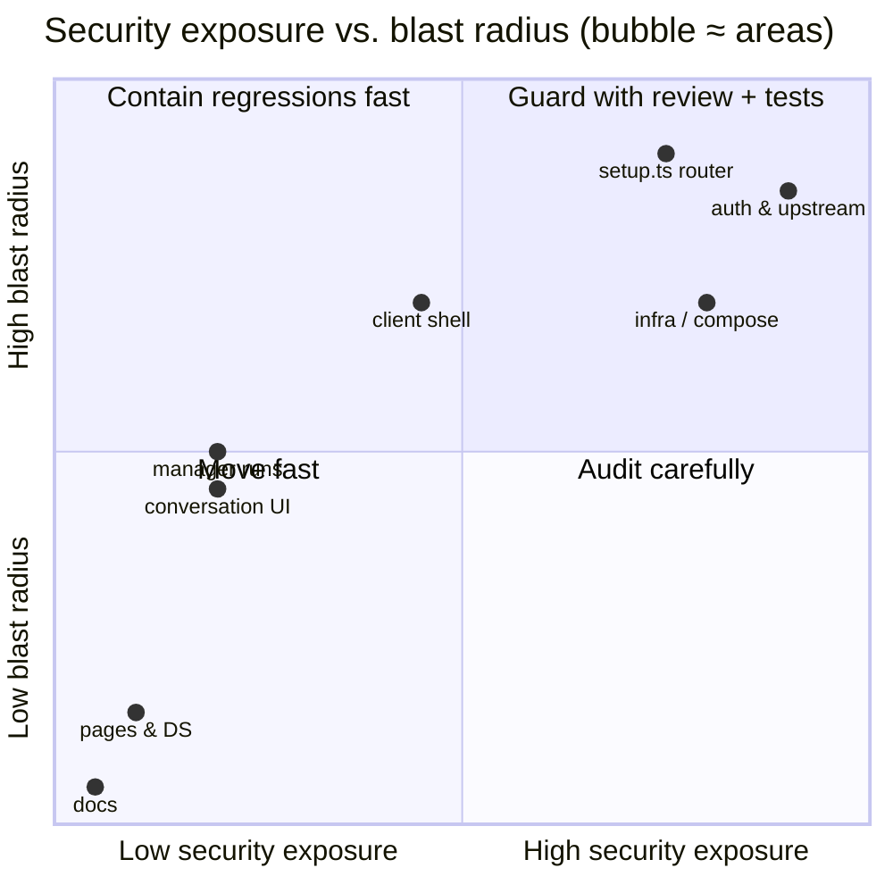

# Risk map

Not all code here is equally dangerous to change. This map assigns every area a profile across
**four dimensions**, so a reviewer (or CI) can calibrate scrutiny per PR instead of treating all
diffs alike.

> **Machine-readable source of truth:** [`.github/risk-map.yml`](../.github/risk-map.yml) —
> consumed by CI to label PRs (`risk:security-high`, `risk:cost-high`, …) and post a risk
> summary comment. Keep this document and the YAML in sync when areas move.

## Dimensions

| Dimension | Question it answers |
|---|---|
| **Security** 🔐 | Does this code guard a credential, an auth boundary, or a proxy surface? |
| **Stability** ⚙️ | How easily does a change here break core flows (SSE, route order, upstream contract)? |
| **Blast radius** 💥 | If this regresses, how much of the app goes down with it? |
| **Cost** 💸 | Can a bug here silently burn LLM spend (runaway runs, duplicate workers)? |

## The matrix

| Area | Paths | 🔐 Security | ⚙️ Stability | 💥 Blast | 💸 Cost | Why |
|---|---|---|---|---|---|---|
| Auth & credentials | `server/auth.ts`, `server/openhands/upstream.ts`, `scripts/openhands-askpass.sh` | **high** | **high** | **high** | low | The entire trust model: who may call the BFF, how the agent-server key and git tokens are held. A leak here exposes every token the app knows. |
| Main BFF router | `server/openhands/setup.ts`, `server/index.ts` | **high** | **high** | **high** | medium | Route mounting is **order-sensitive** (manager before main, 20 MB json before global parser). Hosts the preview reverse proxy (a request-forwarding surface) and model-allowlist enforcement (cost gate). |
| Infra & agent container | `docker-compose.yml`, `scripts/dev.sh`, `sync-mcp.sh`, `sync-agent-settings.sh`, `seed-agent-settings.mjs`, `.env.example`, `deploy/**`, `Dockerfile` | **high** | medium | **high** | low | Controls what the agent container can reach: bind mounts, env/tokens passed in, CLIs installed. A bad mount exposes host directories to agent code. The packaging half is the same class of risk aimed at end users: `deploy/install.sh` is a `curl \| bash` script that writes credentials into their `.env`, and `deploy/compose.yaml` decides the port binding and the `ALLOW_DEV_AUTH` identity fallback ([packaging.md](packaging.md)). |
| Client shell & API layer | `client/main.tsx`, `client/lib/**`, `vite.config.ts` | medium | medium | **high** | low | Routing/nav shell and every API/SSE client — a regression blanks the whole UI. Vite proxy rules (preview bypass) are subtle. |
| Manager orchestration | `server/openhands/manager/**` | low | medium | medium | **high** | Spawns and steers *paid* worker conversations in a polling loop; a state-machine bug can duplicate workers or keep steering a dead run. |
| Auto-resume | `server/openhands/autoResume.ts` | low | medium | low | **high** | Automatically restarts agent runs after BFF restarts — the classic "surprise spend" path if its guards regress. |
| BFF modules | rest of `server/` | medium | medium | medium | low | Terminal-event sanitizing (`terminal.ts`), image validation (`images.ts`), MR shaping, notifier. Each is contained, but several parse untrusted input. |
| Conversation UI | `client/pages/Conversation.tsx`, `client/components/**` | low | medium | medium | low | The most complex client surface (transcript, SSE reconnect, panels) but purely presentational — bugs annoy, don't endanger. |
| Pages & design system | `client/pages/**`, `client/ds/**`, `client/theme/**` | low | low | low | low | Cosmetic and per-page. One exception inside DS: `ds/markdown.tsx` renders with `dangerouslySetInnerHTML` — keep its escaping rules intact when touching it. |
| CI & tests | `.github/**`, `tests/**`, `*.config.ts` | medium | low | low | low | Workflows run with repo tokens — supply-chain hygiene applies (pin actions, no `pull_request_target` foot-guns). |
| Docs | `docs/**`, `*.md` | low | low | low | low | Words. The risk is drift, not breakage — update docs *with* the code they describe. |

## How to use it

- **Authoring a PR**: if you touch a `high` cell, say so in the description and explain the
  mitigation (test added, behavior preserved, key never logged, …).
- **Reviewing**: CI labels the PR with the max level per dimension across touched areas —
  `risk:security-high` means "read the diff, not the summary."
- **Extending the map**: new directory ⇒ new `areas:` entry in the YAML + a row here. When an
  area's profile changes (e.g. a page starts handling tokens), move it — the map is only useful
  while it is honest.
