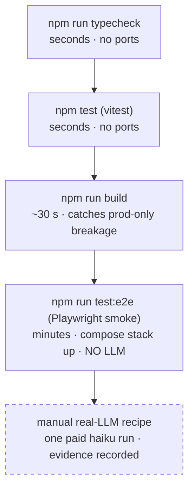

# Testing

Test tiers, cheapest first. The guiding decision (decisions.md #9): real agent runs are
slow/costly/nondeterministic, so the committed suites are **LLM-free** and real-LLM
verification is a documented manual recipe with recorded evidence — *evidence over gating*.



## Tier 1 — typecheck

```bash
npm run typecheck        # client tsconfig.json + server tsconfig.server.json, --noEmit
```

## Tier 2 — unit tests (vitest)

```bash
npm test                 # vitest run; watch mode: npx vitest
```

Tests live in `tests/*.test.ts` and import server/client modules directly — no server process,
no network. Good candidates for unit tests: pure logic in `server/openhands/*` (config parsing,
event shaping, validation) and `client/lib/*`. Do **not** mock what you can test for real.

## Tier 3 — build

```bash
npm run build            # vite build (client) + tsc -p tsconfig.server.json (server)
```

Catches what `typecheck` can't: import-graph issues, vite-only resolution, missing assets.
CI runs it on every PR.

## Tier 4 — Playwright smoke (no LLM)

```bash
npm run test:e2e
```

18 tests (API tier + browser tier) that exercise the app against a **real compose stack**
but never start an agent run — zero LLM cost, safe to loop. Prereqs (full detail:
[`tests/e2e/README.md`](../tests/e2e/README.md)):

1. `.env` present (`PORT=3210` recommended so the suite doesn't fight your dev BFF).
2. Stack up: `docker compose --profile agent --profile manager up -d`.
3. A seeded `demo-project` git repo in `OPENHANDS_PROJECTS_DIR`.

Playwright starts/reuses the app server itself; artifacts on failure: traces, screenshots,
HTML report (`npx playwright show-report`).

## Tier 5 — real e2e (one paid LLM run, manual)

The recipe in [`tests/e2e/README.md`](../tests/e2e/README.md) § Step B: one
`anthropic/claude-haiku-4-5` run creating a file in `demo-project`, then assert the
transcript streamed, the file exists on the host, the diff shows in Changes, and the terminal
audit lists the commands. Record evidence (screen recording / screenshots); keep artifacts out
of git.

## Screenshots in PRs (the `@shots` harness)

Some changes can only be reviewed by looking at them. The default path is the committed
harness: `tests/e2e/shots.ts` declares the shots; `tests/e2e/screenshots.spec.ts` generates
one `@shots`-tagged Playwright test per entry; `npm run screenshots` runs them. CI's smoke
job runs the same set on PRs, uploads a `pr-screenshots` artifact, and maintains one sticky
comment linking it — all `continue-on-error`, never a gate.

**Adding a shot** = one entry in the `SHOTS` array in `tests/e2e/shots.ts`:

```ts
{
  name: "palette-no-match",              // filename stem AND test title — declared once
  description: "Empty state when nothing matches",   // rendered in the PR comment
  theme: "light",
  query: "zzzznope",                     // optional: typed into the palette
  after: (page) => page.getByTestId("openhands-palette-empty").waitFor(),  // optional
}
```

Naming is `<area>-<subject>[-<variant>]`, lower-case and hyphenated. Write the `description`
as what the shot **proves**, not what it depicts.

Five invariants the harness encodes — keep them if you edit it:

- **Tag stays `@shots`.** `playwright.config.ts` absorbs every `*.spec.ts` in `tests/e2e`, so
  the split lives in the npm scripts: `test:e2e` is `--grep-invert @shots`, `screenshots` is
  `--grep @shots`. Drop the tag and your shots silently join (and slow) the smoke suite.
- **Data is a fixture, and the comment says so.** CI's agent-canvas is fresh (empty lists);
  a local one holds real titles and project names. Both are wrong for a published,
  comparable screenshot — every list-shaped endpoint the shot can see must be stubbed via
  `page.route()`.
- **Output stays out of `test-results/`.** Playwright deletes its `outputDir` at the start of
  every run, so a shot written there is destroyed by the next `npm run test:e2e`. Hence
  `screenshots-out/` (gitignored).
- **The manifest is written before Playwright starts.** `scripts/shots-manifest.ts` runs as a
  pre-step so the declared set survives a run that dies before any test executes. CI diffs
  declared-against-produced and reports `N of M` in the comment.
- **Never a gate.** Shots fail only when a page can't reach the state — no pixel-diff
  assertions (decision #9: evidence over gating). Flipping that is a trap: a hard capture
  failure would *skip* the upload and comment steps, losing the partial shots.

Running it locally needs a BFF — and **verify the port is yours** before trusting the output:
`reuseExistingServer: true` means Playwright will happily photograph someone else's server if
one is already listening on the port.

## Testing from inside an agent session

The agent improving this repo runs its checks **in-container** — typecheck and vitest work
as-is; e2e needs `npx playwright install chromium` first. A parallel BFF on `:3001` against
the shared agent-server lets the agent test server changes without touching your live UI.
Full guide: [agent-sessions.md](agent-sessions.md).

## Conventions

- New feature ⇒ at least a unit test where logic allows it; new page ⇒ a smoke-suite case
  (navigate, assert heading + key elements — keep it LLM-free).
- Visible UI change ⇒ a screenshot on the PR. Default: add it to the `@shots` harness
  (see above) and CI attaches the artifact + sticky comment.
- Bug fix ⇒ reproduce with a failing test first when practical.
- Never gate CI on the paid tier; it exists to produce *evidence* for risky releases.
